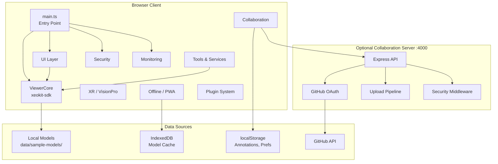
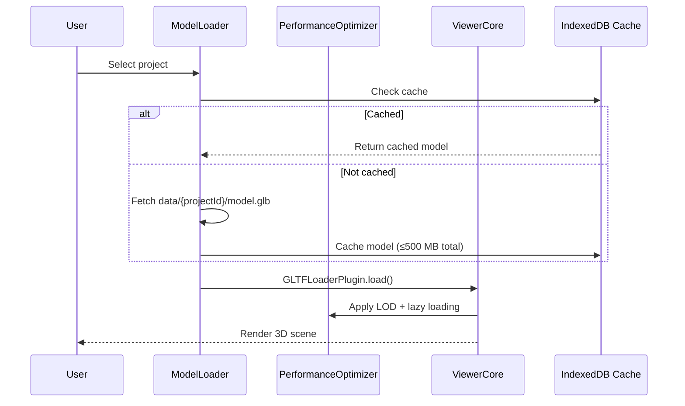
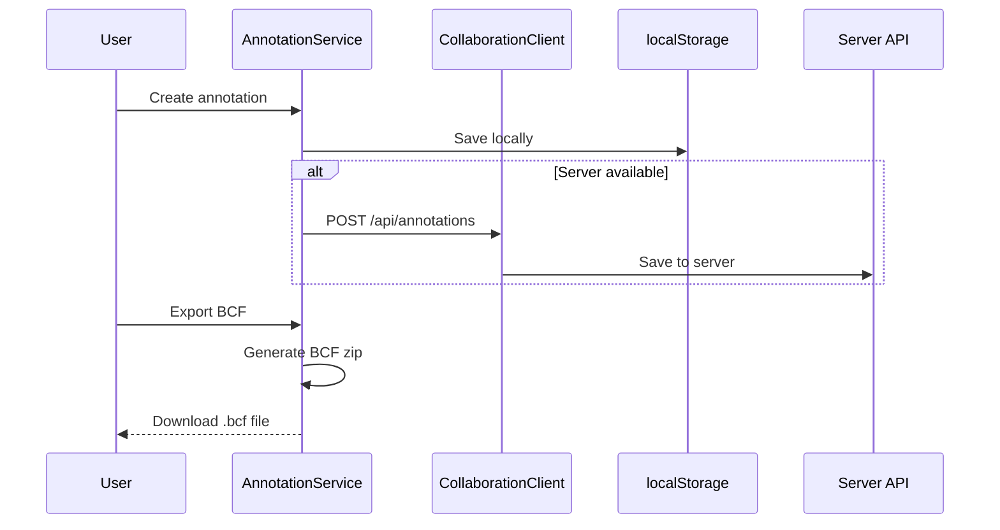
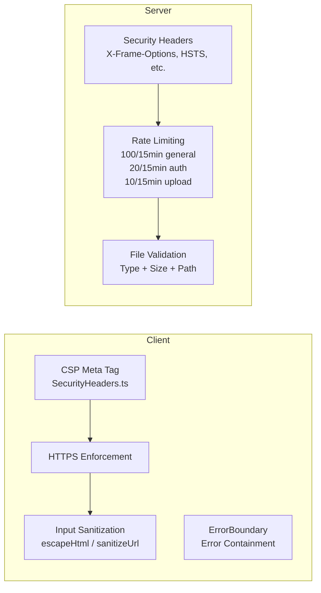

# Architecture — Civil BIM Viewer

> **Last updated:** 2026-03-24 (Phase 7 complete)
> **Version:** 2.0.0

This document describes the high-level architecture of the Civil BIM Viewer, an open-source, browser-based BIM/IFC viewer for civil and civic engineering.

---

## System Overview



---

## Module Map

### Client (`src/`)

| Directory | Module | Responsibility |
|-----------|--------|---------------|
| `viewer/` | **ViewerCore** | xeokit `Viewer` wrapper — 3D/2D modes, camera, NavCube, section planes, X-ray, selection |
| `viewer/` | **PerformanceOptimizer** | LOD culling, IndexedDB model caching (500 MB), lazy loading, FPS metrics |
| `loader/` | **ModelLoader** | Loads glTF/GLB models via `GLTFLoaderPlugin`, reads project metadata |
| `annotations/` | **AnnotationService** | CRUD for annotations, localStorage persistence, JSON/BCF export |
| `annotations/` | **AnnotationOverlay** | 3D marker rendering via `AnnotationsPlugin`, interactive add mode |
| `tools/` | **MeasurementTool** | Two-point + path distance measurement, snapping, metric/imperial |
| `tools/` | **ChainStationingTool** | IfcAlignment detection, station numbering, CSV/JSON export |
| `tools/` | **BCFService** | BCF 2.1 zip generation and import with viewpoint round-trip |
| `ui/` | **UIController** | Master UI wiring — toolbar, keyboard shortcuts, ARIA navigation |
| `ui/` | **TreeView** | IFC hierarchy tree panel, click-to-isolate with camera flyTo |
| `ui/` | **PropertiesPanel** | Object metadata display with XSS-safe HTML escaping |
| `ui/` | **FilterPanel** | Layer/discipline checkboxes, Show/Hide All, X-ray toggle |
| `ui/` | **StoreyNavigator** | IfcBuildingStorey navigation, plan-level isolation |
| `ui/` | **UtilitiesPanel** | Underground pipe/duct metadata, "What's below" toggle |
| `collaboration/` | **CollaborationClient** | REST client for remote annotations, viewpoint sharing, GitHub OAuth |
| `collaboration/` | **RealtimeSync** | WebSocket presence, live annotation sync, role-based permissions |
| `i18n/` | **I18nService** | EN/VI/FR translations, locale detection/persistence |
| `offline/` | **OfflineStorage** | IndexedDB wrapper, storage budgets, background sync queue |
| `offline/` | **ServiceWorkerManager** | SW registration, app-shell caching, version management |
| `plugins/` | **PluginAPI** | Plugin contract — manifest, lifecycle hooks, sandboxed context |
| `plugins/` | **PluginLoader** | Plugin registration, permission checking, error containment |
| `security/` | **SecurityHeaders** | CSP meta-tag injection, HTTPS enforcement, XSS sanitization |
| `monitoring/` | **Logger** | Structured JSON logging, level filtering, sensitive data redaction |
| `monitoring/` | **ErrorBoundary** | Global error/rejection handling, user-friendly error overlay |
| `xr/` | **VisionProUI** | Headset UI — gaze focus, pinch select, radial menu, ≥10 mm targets |
| `xr/` | **WebXRSession** | WebXR Device API bridge — AR/VR immersive sessions (prototype) |

### Server (`server/`)

| Module | Responsibility |
|--------|---------------|
| **index.ts** | Express server — GitHub OAuth, annotation storage, CORS, rate limiting |
| **SecurityMiddleware** | Security headers, HTTPS redirect, path sanitization |
| **ConversionQueue** | IFC → glTF/XKT conversion job queue (in-memory; Redis-ready interface) |
| **ModelStorage** | File storage abstraction (local filesystem; S3-ready interface) |
| **UploadEndpoint** | IFC upload validation (type, size), conversion job dispatch |

---

## Data Flow

### Model Loading



### Annotation Workflow



### Security Flow



---

## Technology Stack

| Layer | Technology | Version |
|-------|-----------|---------|
| **3D Engine** | xeokit-sdk | 2.6.106 |
| **Language** | TypeScript (strict) | 5.9.3 |
| **Bundler** | Vite | 6.4.1 |
| **Server** | Express (optional) | 4.x |
| **Testing** | Jest + ts-jest + jsdom | 29.x |
| **E2E** | Playwright | 1.42 |
| **Accessibility** | axe-core | via @axe-core/playwright |
| **CI/CD** | GitHub Actions | — |
| **Container** | Docker (nginx 1.27) | — |

---

## Key Design Decisions

### 1. xeokit requires `unsafe-eval` in CSP

xeokit-sdk internally uses `new Function()` for shader compilation and data processing. The CSP `script-src` directive must include `'unsafe-eval'`. This is documented in [SecurityHeaders.ts](../src/security/SecurityHeaders.ts) and the nginx config.

### 2. Client-first architecture with optional server

The viewer works **100% client-side** with local model files. The Express server is optional and only adds collaboration features (annotation sync, OAuth, file upload). This enables static hosting (GitHub Pages, S3) for read-only use cases.

### 3. Plugin sandboxing without iframes

Plugins use a `PluginContext` object with restricted API surface rather than iframe isolation. This avoids cross-origin complexity while preventing plugins from accessing `ViewerCore` directly.

### 4. Offline-first PWA design

Annotations persist to localStorage first, then sync to server when available. The ServiceWorker caches the app shell and model assets in IndexedDB (up to 500 MB budget). The app remains fully functional offline.

### 5. Server uses in-memory stores

The collaboration server uses in-memory Maps for sessions/annotations. This is intentional for simplicity — production deployments should swap in Redis/PostgreSQL via the existing interfaces (`StorageBackend`, etc.).

---

## Directory Structure

```
civil/
├── src/                    # Client application
│   ├── main.ts             # Entry point
│   ├── index.html          # HTML shell (Vite root)
│   ├── annotations/        # Annotation CRUD + 3D overlay
│   ├── collaboration/      # REST client + WebSocket sync
│   ├── i18n/               # Internationalization (EN/VI/FR)
│   ├── loader/             # Model loading (glTF/GLB)
│   ├── monitoring/         # Logger + ErrorBoundary
│   ├── offline/            # IndexedDB cache + ServiceWorker
│   ├── plugins/            # Plugin API + loader
│   ├── security/           # CSP, HTTPS, sanitization
│   ├── styles/             # CSS
│   ├── tools/              # Measurement, BCF, ChainStationing
│   ├── ui/                 # Panels, tree, filter, toolbar
│   ├── viewer/             # ViewerCore + PerformanceOptimizer
│   └── xr/                 # VisionPro UI + WebXR session
├── server/                 # Optional Express collaboration server
│   ├── index.ts            # Server entry point
│   ├── middleware/          # Security middleware
│   └── pipeline/           # Upload, conversion queue, storage
├── tests/
│   ├── unit/               # Jest unit tests
│   ├── e2e/                # Playwright E2E tests
│   └── performance/        # Performance benchmarks
├── data/sample-models/     # Sample BIM models
├── docker/                 # Dockerfile + nginx config
├── docs/                   # Documentation
│   ├── feature-guides/     # Per-feature usage guides
│   └── reports/            # Validation reports
├── plugins/                # Sample external plugins
└── scripts/                # Build/release scripts
```

---

## Deployment Options

| Option | Description | Infrastructure |
|--------|-------------|----------------|
| **Static (GitHub Pages)** | Client-only, no collaboration | `deploy.yml` workflow |
| **Docker (nginx)** | Client-only in container | `Dockerfile` → ghcr.io |
| **Full stack** | Client + Express server | Docker Compose or separate deploys |

The release workflow (`release.yml`) automatically builds and publishes Docker images to GitHub Container Registry on every version tag.
